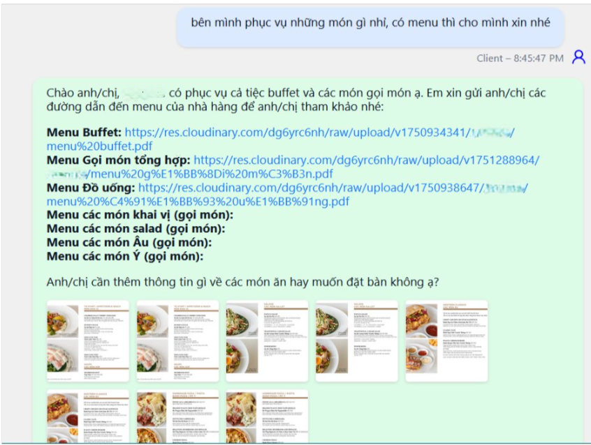
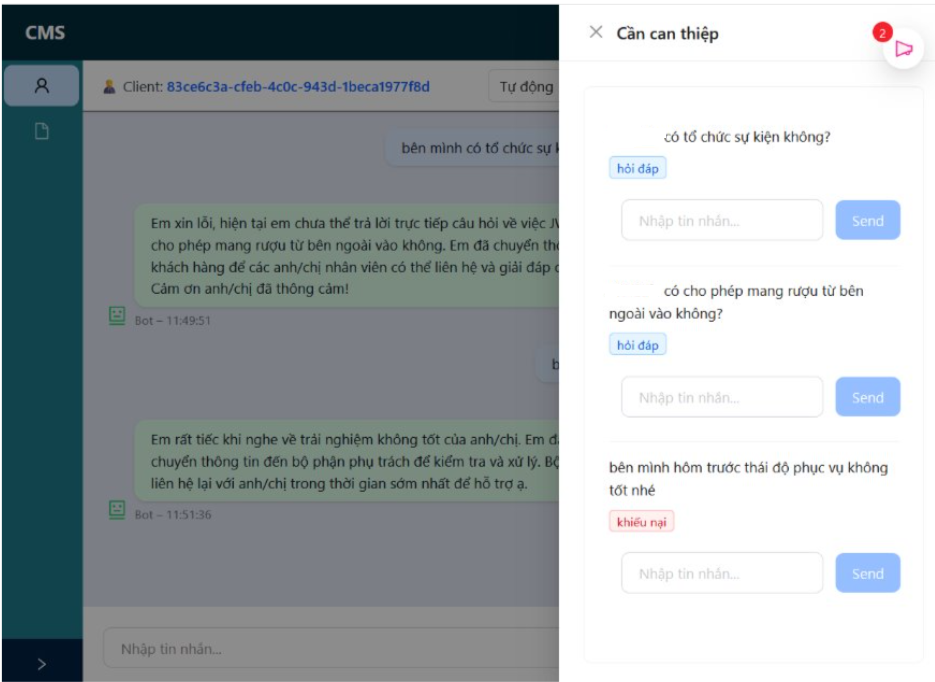

# Giải pháp chăm sóc khách hàng bằng LLM cho các doanh nghiệp dịch vụ nhỏ

Sử dụng kiến trúc RAG và multi-agent để xây dựng một nền tảng nhắn tin chăm sóc khách hàng hỗ trợ các nghiệp vụ như hỏi đáp, lên đơn, khiếu nại.

Đảm bảo:
- Dịch vụ nhắn tin chuyên biệt cho CSKH
- Agent sinh phản hồi tương ứng các nghiệp vụ “hỏi đáp”, “lên đơn”​
- Agent chuyển tiếp các yêu cầu vượt quá khả năng và “khiếu nại”​
- Tự động trích xuất thông tin​ khách hàng
- Tự động lên đơn khi nhận thấy nhu cầu của khách​

Giao diện:
Màn nhắn tin của khách hàng

Màn nhắn tin của nhân viên

Hai chế độ vận hành “Auto” và “Manual”​
- “Auto”: Agent tương tác trực tiếp với khách hàng​
- “Manual”: Agent hoạt động như hệ trợ giúp quyết định 

Các tin nhắn chatbot không trả lời được(RAG không cho ra kết quả) được lưu vào hội thoại để nhân viên xử lý

Hiện thông tin khách hàng trích xuất được trong khung chat

## Mục lục

- [Phân tích thiết kế](#phan-tich-thiet-ke)
- [Xây dựng sản phẩm](#xay-dung-san-pham)

## [Phân tích thiết kế](#phan-tich-thiet-ke)
### Usecase tổng quan

Ba tác nhân chính tham gia hệ thống gồm nhân viên, quản lý doanh nghiệp và khách hàng

### Usecase nhắn tin

Cơ chế chọn và bỏ chọn đảm bảo tại một thời điểm một khách chỉ nhắn tin với một nhân viên.
Agent cung cấp phản hồi dựa trên chế độ hội thoại.

### Usecase quản lý đơn

Agent trích xuất thông tin từ hội thoại, nhận biết ý định lên đơn và tạo đơn.​

## [Xây dựng sản phẩm](#xay-dung-san-pham)

### Cấu trúc thư mục

### Tổng quan dự án

Cấu trúc backend server

#### Chat Server:

Tổ chức dữ liệu trong redis
redisStructure

chi tiết schema

message_queue chứa tin nhắn của những khách hàng chưa được nhận

Tổ chức dữ liệu trong mongodb

#### Workflow sinh phản hồi
Kiến trúc langGraph

Trong đó node reAct agent là phối hợp của 2 agent và 1 RAG pipeline.
node decompose hoạt động như sau

nhận vào một truy vấn đa ý định và trả về các mảng ý định ví dụ như: "tôi muốn A, tôi muốn B" -> ["muốn A", "muốn B"]

Kiến trúc ReAct agent

Agent Conversation

Agent Reservation

RAG pipeline

Thực hiện search 2 lần. Lần 1 dùng hệ số alpha 0.7(gần tìm kiếm vector) để tìm kiếm rộng, lần 2 dùng hệ số alpha 0.3(gần tìm kiếm text)

#### Hệ quản trị nội dung
Các chức năng của hệ quản trị nội bộ

